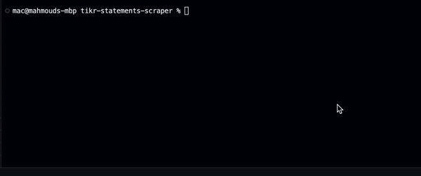

# TIKR Financial Statements Scraper
A tool to scrape historical financial statements of companies from TIKR website and have them listed in an excel spreadsheet for a quicker analysis and market research.

## Introduction
TIKR among the best sites that provide tools for Stock Market Research and Investor Analysis. It has a terminal where users can look for historical financial statements. The purpose of this tool is to have offline copies of the required statements in an easy-to-use spreadsheet that allows investors to make analysis quicker and use their custom formulae easily on the statements tables.

## Installation & Usage

### Pre-requisites:
- Python 3.x (Download: https://www.python.org/downloads/)
- Libraries (`pip3 install -r requirements.txt`)

### Set up:
- Clone the repository (`git clone https://github.com/membaby/tikr-statements-scraper`)
- Update `config.py` file with your TIKR account credentials.

### Usage:
- Run `python3 TIKR.py` (`python TIKR.py` on Windows)
- Enter the company name (eg. `Apple`) or stock ticker symbol (eg. `AAPL`)

## Overview

### Scraping Process
1. User enters company name or stock ticker symbol.
2. Script generates access token and stores it locally in `token.tmp` for quicker scraping in case multiple companies financial statements are required.
3. Script uses the generated access token to fetch the historical statements of desired company.
4. Script creates a new excel spreadsheet.

### Steps Visualization


### Data 
Please refer to `./sample-outputs/` folder for data samples.

1. Income Statements
```
Revenues
Total Revenues
Total Revenues YoY
Cost of Goods Sold
Gross Profit
Gross Profit YoY
% Gross Margins
Selling General & Admin Expenses
R&D Expenses
Total Operating Expenses
Operating Income
Operating Income YoY
% Operating Margins
Interest Expense
Interest And Investment Income
Currency Exchange Gains (Loss)
Other Non Operating Income (Expenses)
EBT Excl. Unusual Items
Gain (Loss) On Sale Of Investments
Gain (Loss) On Sale Of Assets
Asset Writedown
In Process R&D Expenses
Legal Settlements
Other Unusual Items
EBT Incl. Unusual Items
Income Tax Expense
Earnings From Continuing Operations
Earnings Of Discontinued Operations
Net Income to Company
Net Income
Net Income to Common Incl Extra Items
% Net Income to Common Incl Extra Items Margins
Net Income to Common Excl. Extra Items
% Net Income to Common Excl. Extra Items Margins
Diluted EPS Excl Extra Items
Diluted EPS Excl Extra Items YoY
Weighted Average Diluted Shares Outstanding
Weighted Average Diluted Shares Outstanding YoY
Weighted Average Basic Shares Outstanding
Weighted Average Basic Shares Outstanding YoY
Basic EPS
EBITDA
EBITDA YoY
EBITDAR
R&D Expense
Selling and Marketing Expense
General and Administrative Expense
Effective Tax Rate %
```

2. Cashflow Statements
```
Net Income
Depreciation & Amortization
Amortization of Goodwill and Intangible Assets
Total Depreciation & Amortization
(Gain) Loss From Sale Of Asset
(Gain) Loss on Sale of Investments
Asset Writedown & Restructuring Costs
Stock-Based Compensation
Tax Benefit from Stock Options
Net Cash From Discontinued Operations
Other Operating Activities
Change In Accounts Receivable
Change In Inventories
Change In Accounts Payable
Change in Unearned Revenues
Change In Income Taxes
Change in Other Net Operating Assets
Cash from Operations
Change in Net Working Capital
Capital Expenditure
Sale of Property, Plant, and Equipment
Cash Acquisitions
Divestitures
Sale (Purchase) of Intangible assets
Investment in Marketable and Equity Securities
Other Investing Activities
Cash from Investing
Total Debt Issued
Total Debt Repaid
Issuance of Common Stock
Repurchase of Common Stock
Other Financing Activities
Cash from Financing
Foreign Exchange Rate Adjustments
Net Change in Cash
Free Cash Flow
Free Cash Flow YoY
% Free Cash Flow Margins
Cash and Cash Equivalents, Beginning of Period
Cash and Cash Equivalents, End of Period
Cash Interest Paid
Cash Taxes Paid
Cash Flow per Share
```

3. Balance Sheet Statements
```
Cash And Equivalents
Short Term Investments 
Total Cash And Short Term Investments 
Accounts Receivable
Other Receivables 
Notes Receivable
Total Receivables
Inventory 
Prepaid Expenses
Deferred Tax Assets Current
Restricted Cash
Other Current Assets 
Total Current Assets 
Gross Property Plant And Equipment
Accumulated Depreciation
Net Property Plant And Equipment 
Long-term Investments 
Goodwill
Other Intangibles
Loans Receivable Long-Term 
Deferred Tax Assets Long-Term 
Other Long-Term Assets 
Total Assets 
Accounts Payable
Accrued Expenses
Short-term Borrowings 
Current Portion of Long-Term Debt
Current Portion of Capital Lease Obligations
Current Income Taxes Payable 
Unearned Revenue Current 
Other Current Liabilities 
Total Current Liabilities 
Long-Term Debt 
Capital Leases
Unearned Revenue Non Current
Deferred Tax Liability Non Current 
Other Non Current Liabilities 
Total Liabilities 
Preferred Stock Convertible 
Preferred Stock - Others 
Total Preferred Equity 
Common Stock
Additional Paid In Capital
Retained Earnings
Comprehensive Income and Other 
Total Common Equity 
Total Equity 
Total Liabilities And Equity 
Total Shares Out. on Filing Date 
Book Value/Share 
Tangible Book Value
Tangible Book Value/Share 
Total Debt 
Net Debt
Equity Method Investments 
Land 
Buildings 
Construction In Progress 
Full Time Employees
```

## Notes
This software uses TIKR platform to fetch the data. It requires a paid membership in order to extract all historical data, although a free membership would work with restrictions. Find more information on [TIKR website](https://www.tikr.com).